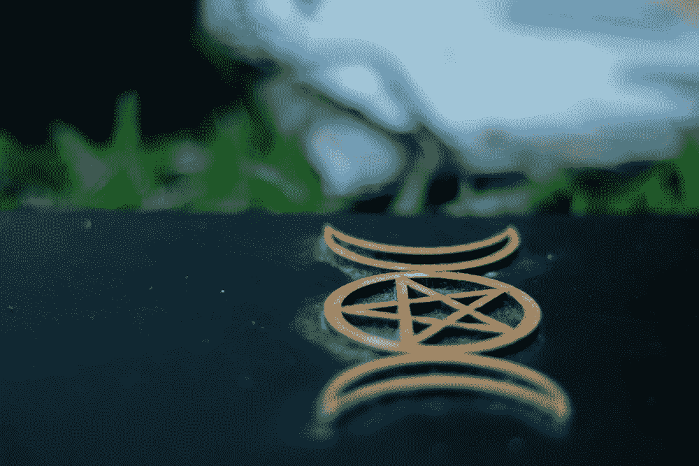

<!--yml
category: 未分类
date: 2024-06-12 18:09:48
-->

# Are Wiccan Books Still Relevant? The 10 Best Bets - Craft of Wicca

> 来源：[https://craftofwicca.com/wiccan-books-thoughts-from-a-decade-of-reading/#0001-01-01](https://craftofwicca.com/wiccan-books-thoughts-from-a-decade-of-reading/#0001-01-01)

Wiccan books are a tricky subject for me.

 As you can tell from the rest of this site, I don’t advocate for following other people’s ideas about their craft.

 It’s good to get ideas and then experiment to find what works for you.

 Given this, I haven’t been a big reader in the past few years. But earlier in my life, I was ravenous. I read everything I could find.

 I loved collecting books and the feeling of curling up on the couch. From the feel of the paper to imagining these wise people telling me about their experiences—I cherished every part of it.

Here are my thoughts and recommendations of Wiccan books from over a decade of reading it.

 ## Are Wiccan Books Still Relevant?

This is a mixed bag for me. Wicca is an ancient tradition, so books never get old or irrelevant. Books also serve as excellent guides for whatever your practice needs.

I still lay open a book when trying something new because it looks less tacky than a sheet of paper with scribbled notes on it or my phone. *Shudder.* I hate technology being around when trying to connect with nature or the divine.

 That being said, Wiccan books are a bit tricky, because you need them ahead of time. And sometimes, you just don’t know what you’ll need.

 Youtube gives you great visuals about what to be doing and how to do it instantaneously. Sites like this one are easy to search.

Websites, forums, apps, videos…it’s really hard to say that books are still relevant amidst all of these tools.

 Let’s give the counterargument one more time. Books tend to be much better researched and vetted than sites or videos.

 If you want to learn about historical context or see a bunch of citations for further study, books can’t be beaten.

So, are they still relevant? You be the judge. I’ll always err on the side of Wiccan books for reference and use.

 The rest of this article will give you my best finds for Wiccan books.

 ## Where to Find the Best Wiccan Books

First off, where can you find where Wiccan books? It’s hard to recommend anything but Amazon these days.

I may disagree with some of its business practices, but you can easily find pretty much every single book ever written on Amazon.

 This was not always the case, and I remember many times hunting for certain books on eBay or local used bookstores before Amazon was a household name.

 If you can, I’d highly recommend going to a local bookstore. You can find a [listing at WitchVox](http://www.witchvox.com/vn/vn_index/xshops.html).

 I’m not sure how frequently they update the list, but a quick Google search for things like “pagan bookstore” “Wiccan store” or “occult shop” should bring up anything nearby.

 These local stores may be a little more expensive, but it’s important to support them if you have the money. They tend to carry a lot of supplies you can’t find online easily.

 They also might save you in a pinch if you don’t want to wait for something to ship across the country from an online seller.

## Best Wiccan Books for Beginners

My first books were mostly Scott Cunningham, and I can’t recommend them enough.

 I haven’t read them in a decade, yet many of the pages are still clear in my mind. I’m sure you can see his influence on my own thoughts on the craft all over this site.

 I haven’t intentionally tried to copy anything he says, but it’s always hard to escape your biggest influences.

 *[Wicca: A Guide for the Solitary Practitioner](https://amzn.to/2KLyffl)* is essential reading for a beginner, in my opinion. His other great beginner book is *[Earth Power](https://amzn.to/2KVIY6K)*, which gets into the basics of [elemental magic](https://craftofwicca.com/elemental-magic-for-beginners/).

 I’ve read many of Lisa Chamberlain’s books, and all the ones I’ve gotten have been great introductions to the subject matter.

 ## Books on Wicca Religion

With the internet, most of the information you can find in a book is out there somewhere for free.

But actually, I still read and recommend books for the religious side of Wicca. This is because it requires a bit more scholarship and expertise than people dumping their personal Books of Shadows with some explanations.

 As I get older, I find myself drawn to this side of my practice more. I’m less results-oriented. I enjoy simple, calm time in nature, and devotions and rituals help bring about that peace.

 A great introductory source is [*Wicca: A comprehensive guide to the Old Religion in the modern world*](https://amzn.to/2GjMWAU) by Vivianne Crowley.

Another book I connected with deeply is *[Goddess Wisdom: Connect to the Power of the Sacred Feminine through Ancient Wisdom and Practices](https://amzn.to/2GiDrSu)*  by Tanishka. This one isn’t explicitly Wiccan, but it is a great way to connect with the goddess.

 My last recommendation here is *[The Circle Within: Creating a Wiccan Spiritual Tradition](https://amzn.to/2Gl6FQF)*  by Diane Sylvan. This is a beautiful book about continuing your growth in Wicca after you’ve learned the basics.

 ## Antique Witchcraft Books

You may think there’s not much use in the books above. You could just check these modern books out a library. Or maybe you’ve even read enough that these are too elementary for you.

I think it’s a worthwhile endeavor to collect some older books that are out of print.

 I don’t have much to say about this since you’ll either find it interesting or not.

 One of the best ways to do this is to periodically look through eBay. I’ve found so many rare antique books. They are thrilling to find and to read.

These should interest any Wiccan because you get to see and read about Wicca from a point of view almost no one else ever will.

 ## My Other Favorites

As I’ve said elsewhere, ancient Celtic and Druidic practices have greatly informed my practice.

 An early influence in my path was the great *[The 21 Lessons of Merlyn: A Study in Druid Magic and Lore](https://amzn.to/2UoLjH1)* by Douglas Monroe.

Unfortunately, I lost my copy when I moved, so I’m not sure how well it stands up today. It was my introduction to the subject, so I might find it lacking now.

 Another great classic is *[The Book of Runes](https://amzn.to/2GimRlE)* by Ralph H. Blum. This is a solid introduction and the linked version even comes with a set of runes.

 After I started studying runes, I incorporated them into many parts of my craft. They are powerful ancient symbols that work great in Wicca today.

I’ll continue to add to this list as I think of more. The best Wiccan books are the ones that work the best for your practice. My thoughts can help guide you to a starting place, but the books you think are the best are going to be different from mine. I guarantee it!